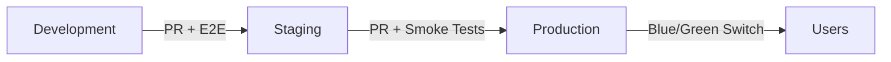

# CI/CD Automation & Architecture 🛠️

This document details the CI/CD pipeline implemented in this project. It is designed for **automation**, **security**, and **reliability**.

## 🔄 Workflow Topology

The pipeline moves code through three environments with increasing quality gates.



### 1. Development (CI)
- **Source:** `develop` branch.
- **Trigger:** Push to `develop`.
- **Checks:** Linting, Unit Tests, Snyk Security Scan.
- **Deployment:** Automatic to OpenShift `rylangraham02-dev`.

### 2. Staging (Quality Gate)
- **Source:** `staging` branch.
- **Trigger:** PR merge from `develop`.
- **Checks:** Full E2E Test Suite (10+ tests).
- **Deployment:** 2 Replicas for high availability testing.

### 3. Production (CD & Blue-Green)
- **Source:** `main` branch.
- **Strategy:** **Native Blue-Green Deployment**.
  - **Zero Downtime:** Users never see a maintenance page.
  - **Mechanism:**
    1. Detects Active Color (Blue or Green).
    2. Deploys to Idle Color.
    3. Runs Smoke Tests (`curl` verification).
    4. Switches Live Traffic Route.
- **Observability:** Logs indicate `Current Active: BLUE` or `GREEN`.

---

## 📂 Implementation Details

### Infrastructure (Kustomize)
| Environment | Overlay Path | Strategy |
|-------------|--------------|----------|
| **Dev** | `k8s/overlays/dev` | Rolling Update |
| **Staging** | `k8s/overlays/staging` | Rolling Update (2 replicas) |
| **Prod Blue** | `k8s/overlays/prod-blue` | Idle/Active Slot |
| **Prod Green** | `k8s/overlays/prod-green` | Idle/Active Slot |

### GitHub Actions Workflows
All workflows are modular and located in `.github/workflows/`.

- `dev-pr.yml` / `dev-deploy.yml`
- `staging-pr.yml` / `staging-deploy.yml`
- `prod-pr.yml` / `prod-deploy.yml` (Contains Blue-Green Logic)

---

## 🧪 Testing Strategy

1. **Unit Tests:** Jest (Individual components).
2. **E2E Tests:** Supertest (HTTP Root, 404s, Headers, Concurrent Load).
3. **Smoke Tests:** Post-Deployment Verification (Curl check on Prod URL).

---

## 🕵️‍♂️ Verifying Production Status

To check which Production color is active (Blue or Green):

**CLI:**
```bash
oc get route prod-mdas-ci-practice -n rylangraham02-dev -o jsonpath='Active Service: {.spec.to.name}'
```

**Console:**
Navigate to **Networking -> Routes** in OpenShift and check the target Service.
