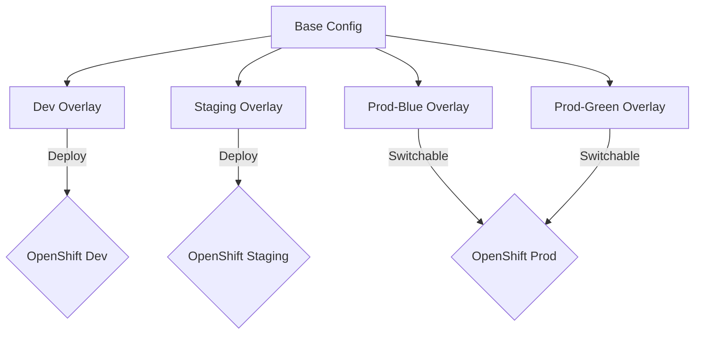

# CI/CD Automation & Architecture 🛠️

This document details the CI/CD pipeline implemented in this project. It is designed for **automation**, **security**, and **reliability**.

## 🔄 The Pipeline at a Glance

The pipeline distinguishes clearly between **Continuous Integration (CI)**, which happens on Pull Requests, and **Continuous Deployment (CD)**, which happens on Merge (Push).

| Phase | Trigger | Goal | Workflows Involved |
|-------|---------|------|--------------------|
| **1. Integration (CI)** | Open/Update **Pull Request** | Verify code quality, security, and tests *before* merging. | `dev-pr.yml`, `staging-pr.yml`, `prod-pr.yml` |
| **2. Deployment (CD)** | **Merge** (Push) to Branch | Build Docker image and update the live environment. | `dev-deploy.yml`, `staging-deploy.yml`, `prod-deploy.yml` |

---

## 🚦 Workflow Stages Breakdown

### 1. Development (Fast Loop)

**Target Environment:** `rylangraham02-dev`

#### A. Pull Request (`dev-pr.yml`)
*Trigger: PR to `develop`*
1.  **Lint:** Checks code style (ESLint).
2.  **Unit Tests:** Runs `npm test`.
3.  **Security Scan:** Runs Snyk to check for vulnerabilities in dependencies.
    *   *Result:* Must pass all 3 to allow merge.

#### B. Deployment (`dev-deploy.yml`)
*Trigger: Merge to `develop`*
1.  **Docker Build:** Builds image tag `:develop`. Pushes to GitHub Container Registry.
2.  **OpenShift Deploy:**
    *   Logs in to OpenShift.
    *   Applies `k8s/overlays/dev` (Rolling Update, 1 Replica).
    *   Verifies rollout status.

---

### 2. Staging (Quality Gate)

**Target Environment:** `rylangraham02-dev` (Staging Service)

#### A. Pull Request (`staging-pr.yml`)
*Trigger: PR to `staging`*
1.  **Lint & Unit Tests:** Regression check.
2.  **Security Scan:** Ensures no new vulnerabilities.
3.  **E2E Tests:** Runs `npm run test:e2e` against the code.
    *   *Critical:* Validates API endpoints, headers, and error handling.

#### B. Deployment (`staging-deploy.yml`)
*Trigger: Merge to `staging`*
1.  **Docker Build:** Builds image tag `:staging`.
2.  **OpenShift Deploy:**
    *   Applies `k8s/overlays/staging`.
    *   **2 Replicas:** Tests high availability configuration.

---

### 3. Production (Zero Downtime)

**Target Environment:** `rylangraham02-dev` (Production Service)

#### A. Pull Request (`prod-pr.yml`)
*Trigger: PR to `main`*
1.  **Full Suite:** Lint, Unit, Snyk (High Severity Threshold), E2E.
2.  **Strict Gate:** Blocks merge on *any* failure.

#### B. Deployment (`prod-deploy.yml`) 🔵/🟢
*Trigger: Merge to `main`*
1.  **Docker Build:** Builds image tag `:latest` and `:prod-{sha}`.
2.  **Native Blue-Green Deployment:**
    *   **Detect Active:** Checks if Main Route points to Blue or Green.
    *   **Deploy Idle:** If Blue is active, deploys to Green (and vice versa).
    *   **Wait:** Verifies the new deployment is 100% ready.
    *   **Switch:** Updates Main Route to point to the new color.
    *   *Result:* Zero downtime switch for users.
3.  **Smoke Tests:**
    *   Executes `curl` against the Production URL.
    *   Must return `200 OK` to succeed.

---

## 🛠️ Infrastructure Topology

The project uses **Kustomize** to manage environment differences without duplicating code.



### Key Files
- `k8s/base/`: Common Deployment, Service, and Route definitions.
- `k8s/overlays/prod-blue/route-patch.yaml`: "I am the Blue Service".
- `k8s/overlays/prod-green/route-patch.yaml`: "I am the Green Service".
- `.github/workflows/prod-deploy.yml`: The logic script that orchestrates the traffic switch.

---

## 🕵️‍♂️ Monitoring & Verification

### How to Check Production Status
To see which "Color" is currently serving traffic:

**CLI Command:**
```bash
oc get route prod-mdas-ci-practice -n rylangraham02-dev -o jsonpath='Active Service: {.spec.to.name}'
```

**Output Key:**
- `prod-blue-mdas-ci-practice` = **BLUE** is Live 🔵
- `prod-green-mdas-ci-practice` = **GREEN** is Live 🟢

### Live Links
| Env | URL |
|-----|-----|
| **Dev** | [Link](http://dev-mdas-ci-practice-rylangraham02-dev.apps.rm1.0a51.p1.openshiftapps.com) |
| **Staging** | [Link](http://staging-mdas-ci-practice-rylangraham02-dev.apps.rm1.0a51.p1.openshiftapps.com) |
| **Prod** | [Link](http://prod-mdas-ci-practice-rylangraham02-dev.apps.rm1.0a51.p1.openshiftapps.com) |
