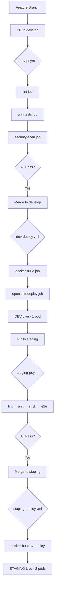

# CI/CD Automation - Complete Implementation ✅

## Final Workflow Structure

### Pull Request Workflows (Quality Gates)

**DEV PR** (`dev-pr.yml`)
```
lint → unit-tests → security-scan
```

**STAGING PR** (`staging-pr.yml`)
```
lint → unit-tests → security-scan → e2e-tests
```

**PROD PR** (`prod-pr.yml`)
```
lint → unit-tests → security-scan (high severity) → e2e-tests
```

### Deploy Workflows

**DEV Deploy** (`dev-deploy.yml`)
```
docker-build → openshift-deploy
```

**STAGING Deploy** (`staging-deploy.yml`)
```
docker-build → openshift-deploy (2 replicas)
```

**PROD Deploy** (`prod-deploy.yml`)
```
docker-build → openshift-deploy (3 replicas) → smoke-tests
```

## Progressive Quality Gates

| Environment | Replicas | PR Jobs | Security Threshold |
|-------------|----------|---------|-------------------|
| DEV         | 1        | lint, unit, snyk | medium |
| STAGING     | 2        | lint, unit, snyk, e2e | medium |
| PROD        | 3        | lint, unit, snyk, e2e + smoke | high |

## E2E Test Suite

Comprehensive tests covering:
- ✅ Root endpoint validation (status, content-type, <500ms)
- ✅ Error handling (404s, invalid methods)
- ✅ Application health (concurrent requests)
- ✅ Response validation (headers, body integrity)
- ✅ 10+ test cases total

## Docker Image Tagging

| Branch | Image Tags |
|--------|-----------|
| `develop` | `develop`, `develop-{sha}` |
| `staging` | `staging`, `staging-{sha}` |
| `main` | `latest`, `prod-{sha}` |

## Workflow Architecture



## Current Deployments

**DEV Environment:**
- Namespace: `rylangraham02-dev`
- Deployment: `dev-mdas-ci-practice`
- Replicas: 1
- Image: `ghcr.io/ronaldsg20/mdas-ci-practice:develop`
- URL: http://dev-mdas-ci-practice-rylangraham02-dev.apps.rm1.0a51.p1.openshiftapps.com
- Status: ✅ Running

**STAGING Environment:**
- URL: http://staging-mdas-ci-practice-rylangraham02-dev.apps.rm1.0a51.p1.openshiftapps.com
- Status: Ready to deploy (waiting for PR merge)

**PROD Environment:**
- URL: http://prod-mdas-ci-practice-rylangraham02-dev.apps.rm1.0a51.p1.openshiftapps.com
- Status: Ready to deploy (waiting for PR merge)

## Topology

**Workflows:**
- `.github/workflows/dev-pr.yml`
- `.github/workflows/dev-deploy.yml`
- `.github/workflows/staging-pr.yml`
- `.github/workflows/staging-deploy.yml`
- `.github/workflows/prod-pr.yml`
- `.github/workflows/prod-deploy.yml`

**Tests:**
- `test/app.e2e-spec.ts` (10+ comprehensive tests)

**Infrastructure:**
- `k8s/base/` (deployment, service, kustomization)
- `k8s/overlays/dev/` (1 replica, develop tag)
- `k8s/overlays/staging/` (2 replicas, staging tag)
- `k8s/overlays/prod/` (3 replicas, latest tag)
